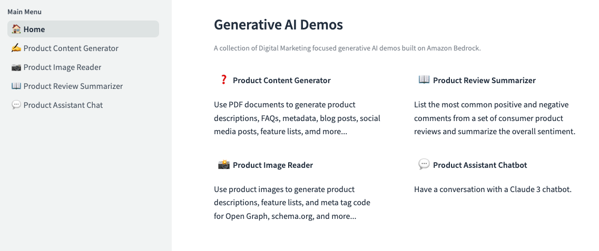

# Digital Marketing Generative AI Demo Apps

This project uses [Streamlit](https://streamlit.io/) to build example generative AI applications on AWS with [Amazon Bedrock](https://aws.amazon.com/bedrock/) focused on digital marketing use cases.

<p align="center"></p>

- **Product Content Generator**: 
Use PDF documents to generate product descriptions, FAQs, metadata, blog posts, social media posts, feature lists, amd more...
- **Product Image Reader**: 
Use product images to generate product descriptions, feature lists, and meta tag code for Open Graph, schema.org, and more...
- **Product Review Summarizer**: 
List the most common positive and negative comments from a set of consumer product reviews and summarize the overall sentiment.
- **Product Assistant Chatbot**: 
Have a text and image-based conversation with a Claude 3 chatbot.

## Install 

Follow these steps to install and run this project on your local integrated development environment (IDE). 

### Local Setup

1. Prerequisites
  - AWS CLI
  - Python
  - IDE (VS Code)

2. Configure the AWS CLI with your permanent AWS credentials. You will need an ```AWS Access Key ID``` and ```AWS Secret Access Key``` for the next step.
   - (Optional) [Create an access key](https://docs.aws.amazon.com/cli/latest/userguide/cli-services-iam-create-creds.html) for an IAM user with AdministratorAccess  if you don't already have one.

 ```
aws configure
```

### Application Setup

1. Use the integrated Terminal to clone this GitHub repository.

```
git clone https://github.com/robsable/amazon-bedrock-genai-streamlit
cd amazon-bedrock-genai-streamlit
```

2. Setup Python virtual env
```
python3 -m venv .venv
source .venv/bin/activate
```

3. Install Python requirements.

```
pip install -r setup/requirements.txt
```

3. Run the Streamlit app.

```
cd app
streamlit run Main_Menu.py
```

4. Click the URL provided to test your running application.

## Customize

Once the app is up and running, you can begin to customize for your own use cases.

1. Edit main menu content for the app in ```app/Main_Menu.py```.

1. Add your own Streamlit scripts to the ```app/demos``` directory.

1. Edit main menu items in ```app/Main_Menu.py```.

1. Edit the home page in ```app/Home.py```.
